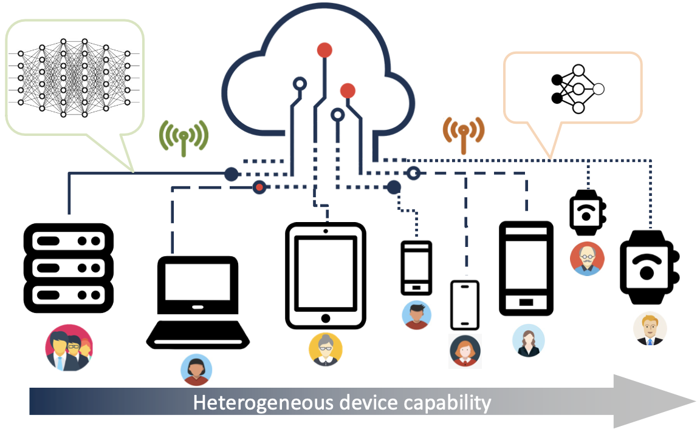

# No One Left Behind: Inclusive Federated Learning over Heterogeneous Devices


## Setup
```shell
conda install --yes --file requirements.txt
```
## Run
```shell
python InclusiveFL/run_fl.py --model_name_or_path roberta-base --task_name sst2 --local_cls --local_one --local_pooler --mom_grad --mom_beta 0.2 --log_round 5
```

## Reference
```latex
@inproceedings{10.1145/3534678.3539086,
author = {Liu, Ruixuan and Wu, Fangzhao and Wu, Chuhan and Wang, Yanlin and Lyu, Lingjuan and Chen, Hong and Xie, Xing},
title = {No One Left Behind: Inclusive Federated Learning over Heterogeneous Devices},
year = {2022},
isbn = {9781450393850},
publisher = {Association for Computing Machinery},
address = {New York, NY, USA},
url = {https://doi.org/10.1145/3534678.3539086},
doi = {10.1145/3534678.3539086},
booktitle = {Proceedings of the 28th ACM SIGKDD Conference on Knowledge Discovery and Data Mining},
pages = {3398–3406},
numpages = {9},
keywords = {knowledge distillation, federated learning, heterogeneous device},
location = {Washington DC, USA},
series = {KDD '22}
}
```